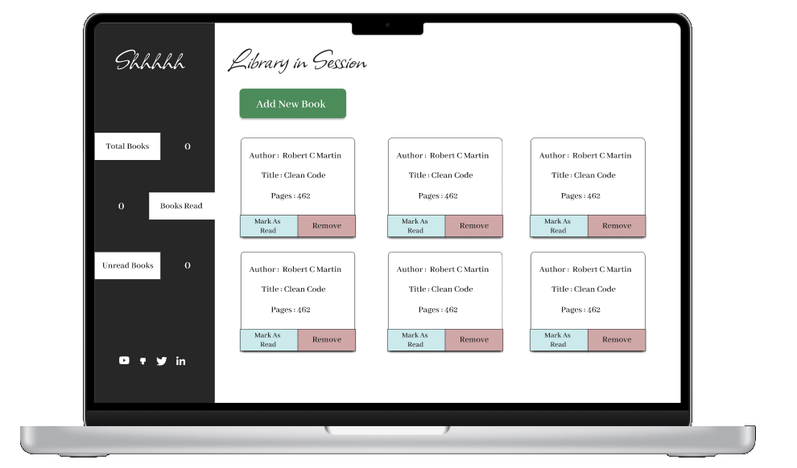

# Library

## Purpose
Software application to mimic the addition and removal of books to/from them Library system. Implemented as part of [The Odin Project](https://www.theodinproject.com/paths/full-stack-javascript/courses/javascript/lessons/library) Curriculum

## Requirements
- [x] Add a Button that will bring up a form allowing users to input book details
- [x] Add a button for each book to remove the book from the library
 + HINT: use data-attribute and array index to link them
- Add a button to `change` its read status

## Technologies

- HTML5
- CSS3
- JavaScript

## Live Version
https://mogoatlhe.github.io/library - Not yet live

## Design

## Lessons Learnt / Challenges Faced

Learnt about the `addEventListener`'s third optional property, which helped me to prevent triggering an event more than once